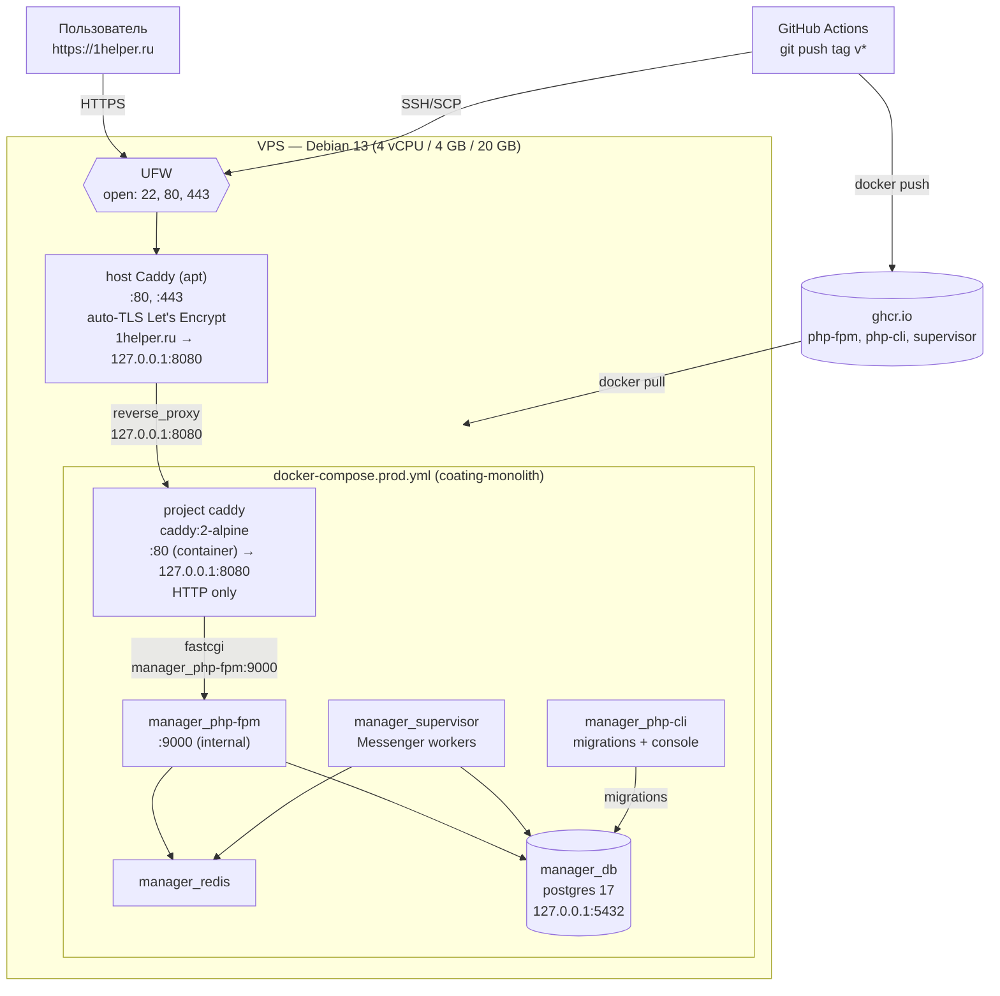

# Деплой нового VPS

**Статус:** draft
**Дата:** 2026-06-25

## Цель

Развернуть production-инстанс приложения на новом VPS. Заменить `manager_nginx` + planned certbot на двухуровневую Caddy-схему: host Caddy как единый TLS-терминатор/router для всех проектов VPS + project Caddy в Docker как self-contained капсула приложения.

## Контекст

Текущий пайплайн:
- GitHub Actions на тег `v*` собирает 3 образа (`php-fpm`, `php-cli`, `supervisor`) → GHCR.
- На сервере: SSH → SCP `docker-compose.prod.yml` → `docker compose down/pull/up -d` → миграции → cache:warmup.
- В compose сейчас: `manager_php-fpm`, `manager_php-cli`, `manager_supervisor`, `manager_nginx`, `manager_redis`, `manager_db`, `elasticsearch`.

Что меняется на новом сервере:
- `manager_nginx` заменяется **project Caddy** (контейнер `caddy:2-alpine` в этом compose). Слушает HTTP-only на 80 внутри контейнера, публикуется на `127.0.0.1:8080`, в TLS не лезет.
- На VPS ставится **host Caddy** через apt — публичные порты 80/443, единая ACME-логика для всех будущих доменов/проектов, маршрутизация `1helper.ru → 127.0.0.1:8080`.
- Elasticsearch временно гасим: контейнер не поднимается. Код Symfony, который ходит в ES, не трогаем — при попытке обращения упадёт исключение, это приемлемо в текущей итерации.
- VPS заказывается с голого Debian 13 (без LEMP-preset). На хосте ставим только Docker Engine, Caddy, UFW.

**Почему два уровня Caddy:** на этом VPS планируются другие проекты. Host Caddy централизует TLS и владение портами 80/443; project Caddy в репо проекта знает структуру именно своего приложения (где `public/`, какие headers/rewrite) и откатывается синхронно с кодом при rollback. Подробнее — см. секцию «Профит двухуровневой схемы».

## Решения, зафиксированные на brainstorming

| Вопрос | Решение |
|---|---|
| Скоуп | Поднять новый VPS с нуля |
| Тариф | 4 vCPU / 4 ГБ RAM / 20 ГБ NVMe (≈1334 ₽/мес) |
| ОС | Debian 13 Trixie, голый (без preset) |
| Домен/DNS | `1helper.ru`, A-запись уже на новом IP |
| Reverse-proxy | Host Caddy (apt) для TLS+маршрутизации; project Caddy (Docker) для приложения |
| Прочий стэк | Postgres + Redis + php-fpm + supervisor в Docker |
| Elasticsearch | Контейнер не запускаем; код не правим |
| БД | Чистая; миграции + сиды |
| CI/CD | Существующий GitHub Actions workflow на тег `v*` |
| Compose-рефакт | Inline-переписывание `docker-compose.prod.yml` |

## Архитектура



ES-контейнер не поднимается. Postgres-порт привязан к `127.0.0.1` для безопасного доступа `pg_dump`/`psql` с хоста. Project Caddy НЕ держит TLS — всё на host Caddy.

## Изменения в репозитории

1. **`docker-compose.prod.yml`** (inline-рефакт):
   - Удалить сервис `manager_nginx`.
   - Удалить сервис `elasticsearch`.
   - Добавить сервис `caddy` (`caddy:2-alpine`), порт `127.0.0.1:8080:80` (HTTP only, TLS на хосте), bind-mount `./infra/Caddyfile:/etc/caddy/Caddyfile:ro` + `./app/public:/app/public:ro`, named volume `caddy_data:/data` (Caddy всё равно хочет /data писать), `depends_on: [manager_php-fpm]`.
   - Объявить top-level volume `caddy_data:`.
   - В `manager_db` заменить `${DB_EXTERNAL_PORT}:5432` на `127.0.0.1:${DB_EXTERNAL_PORT}:5432`.
   - `manager_php-fpm` порты НЕ прокидываем — project Caddy ходит в него через docker network по hostname.

2. **`.github/workflows/deploy.yml`**:
   - Убрать `ELASTIC_*` build-args в шаге `docker/build-push-action`.
   - Убрать запись `ELASTIC_*` в heredoc `.env`-генерации на сервере.

3. **`infra/Caddyfile`** (новый, project-уровень):
   ```
   :80 {
       root * /app/public
       php_fastcgi manager_php-fpm:9000
       file_server
       encode gzip
   }
   ```
   Слушает контейнерный `:80` без домена и без TLS. Публикуется на `127.0.0.1:8080`. Лежит в репозитории, монтируется в project caddy read-only.

4. **`docker/nginx/`** — удалить директорию вместе с конфигами `hosts/*` после удаления `manager_nginx`. Мёртвый код.

5. **`DEPLOYMENT.md`** — переписать под новую раскладку (host Caddy + project Caddy в Docker, без ES).

## One-time runbook на сервере

1. Войти как root по SSH-ключу/паролю провайдера на голый Debian 13.
2. `apt update && apt upgrade -y`.
3. Создать deploy-пользователя:
   ```bash
   adduser --disabled-password deploy
   usermod -aG sudo deploy
   mkdir -p /home/deploy/.ssh && chmod 700 /home/deploy/.ssh
   # положить публичный SSH-ключ deploy в /home/deploy/.ssh/authorized_keys
   chown -R deploy:deploy /home/deploy/.ssh
   chmod 600 /home/deploy/.ssh/authorized_keys
   ```
4. Отключить парольный SSH и root-вход:
   - `/etc/ssh/sshd_config`: `PasswordAuthentication no`, `PermitRootLogin no`.
   - `systemctl restart ssh`.
5. Установить Docker Engine + compose plugin из официального apt-репозитория Docker (для trixie).
   - Добавить deploy в группу `docker`: `usermod -aG docker deploy`.
6. Установить host Caddy: `apt install -y caddy`.
   - Записать `/etc/caddy/Caddyfile`:
     ```
     1helper.ru {
         reverse_proxy 127.0.0.1:8080
     }
     ```
     При добавлении нового проекта на VPS — допишется ещё один блок с другим доменом и другим upstream-портом.
7. UFW:
   ```bash
   apt install -y ufw
   ufw default deny incoming
   ufw default allow outgoing
   ufw allow 22/tcp
   ufw allow 80/tcp
   ufw allow 443/tcp
   ufw enable
   ```
8. `systemctl reload caddy` — host Caddy запросит TLS-сертификат от Let's Encrypt через ACME (порт 80 уже открыт UFW). Сертификат лёг в `/var/lib/caddy/.local/share/caddy/`.
9. Создать директорию проекта:
   ```bash
   mkdir -p /var/www/sites/1helper
   chown deploy:deploy /var/www/sites/1helper
   ```
10. От deploy: склонировать репо в `/var/www/sites/1helper`.
11. Создать `/var/www/sites/1helper/.env` с production-секретами (соответствует структуре, которую генерит heredoc в `deploy.yml`; для первого ручного запуска до тега).
12. Прописать в GitHub Secrets: `SSH_HOST` = новый IP, `SSH_USER` = `deploy`, `SSH_KEY` = приватный ключ deploy-пользователя. Проверить, что остальные secrets/vars (DB, JWT, MAILER, …) заполнены актуальными значениями.
13. Запушить тег `v0.1.0` в main → GHA соберёт образы и задеплоит на сервер. Project caddy-контейнер поднимется и начнёт принимать HTTP на `127.0.0.1:8080` — host Caddy сразу проксирует на него HTTPS-трафик.
14. После первого деплоя создать первого админа через `bin/console` (точная команда — на этапе execute).

## SSL/TLS

Host Caddy получает сертификат на `1helper.ru` автоматически при первом reload. Серты лежат в `/var/lib/caddy/.local/share/caddy/` — переживают любые рестарты Docker и compose. Renewal встроен. HTTP→HTTPS редирект — Caddy делает по умолчанию. Project Caddy в Docker TLS не трогает — слушает plain HTTP на внутреннем :80, который опубликован только на `127.0.0.1:8080`.

## Firewall

UFW: 22/tcp (SSH), 80/tcp (ACME challenge + HTTP→HTTPS), 443/tcp (HTTPS). Postgres-порт привязан к `127.0.0.1` через docker-compose, внешне закрыт.

## БД

При первом запуске Postgres-контейнер инициализирует базу пустой. CI-шаг включает `doctrine:migrations:migrate --no-interaction`. Сиды/фикстуры — если есть в проекте, добавляются отдельным шагом в runbook (уточняется на этапе execute).

## Профит двухуровневой схемы

Зафиксировано как мотивация архитектурного решения — VPS будет хостить ещё проекты.

1. **Один владелец 80/443.** Host Caddy — единственный процесс, держащий публичные порты. Будущие проекты не дерутся за один порт, маршрутизация по `Host`-заголовку.
2. **TLS-консолидация.** Все ACME-серты под `/var/lib/caddy` — один storage, один общий лимит rate-limit от Let's Encrypt. Переход на wildcard-cert делается одним блоком конфига.
3. **Project capsule.** `docker-compose.prod.yml` + `infra/Caddyfile` — самодостаточная капсула: где `public/`, какой rewrite, какой кэш, какие headers. Конфиг живёт в репо приложения, версионируется и откатывается синхронно с кодом.
4. **Независимость обновлений.** `docker compose down` одного проекта не валит host Caddy и не трогает другие проекты. Версия Caddy на хосте обновляется отдельно от Caddy в контейнерах.
5. **Готовая площадка под blue-green/canary.** Поднимаешь project caddy v2 на `127.0.0.1:8081`, в host Caddy меняешь upstream одной строкой, проверяешь — при проблеме откатываешь.

Цена: лишний loopback-хоп (host Caddy → project Caddy → php-fpm, <1мс), ~30–60 МБ RAM на каждый project Caddy, ручная следящая за port-namespacing (8080, 8081, 8082, … для проектов). gzip оставлен на project уровне — host Caddy просто проксирует.

## Что НЕ входит

- Backup-стратегия (внешний storage для дампов).
- Staging-окружение.
- Мониторинг/алёрты.
- Возврат Elasticsearch.
- Blue-green / zero-downtime деплой (текущий `docker compose down/up` даёт секундный даунтайм — приемлемо).
- Ansible/Terraform — провижининг по ручному runbook'у.

## Открытые вопросы

- Команда создания первого админа в `bin/console` — уточнить на этапе выполнения (прочитать команды в `src/Users/.../Console/` или `bin/console list`).
- Наличие сидов/фикстур для production-старта — проверить при выполнении.
